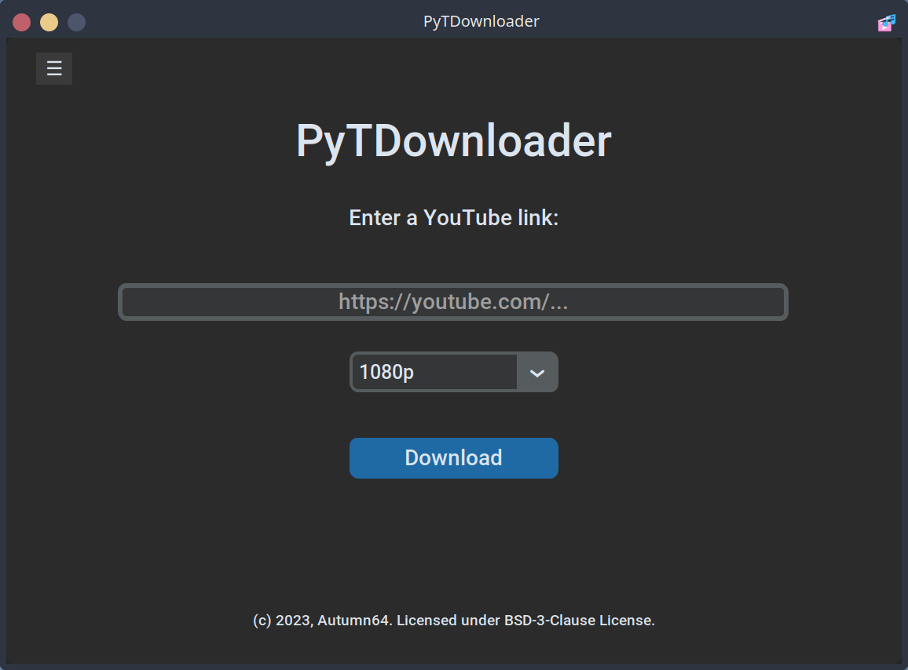

# PyTDownloader


## A free, open-source, modern, simple and portable YouTube downloader.





### Description
PyTDownloader is a YouTube downloader written in Python, which provides a modern-looking and simple interface to download any YouTube video in .mp4 and .mp3 formats.

### Features
- Multi-platform.
- Fast and efficient.
- Includes light and dark mode.
- Languages available: English, Spanish, French, Esperanto.
- Downloads in .mp4 and .mp3 formats.

### AppImage
The AppImage versions (for GNU/Linux users) need `tkinter`, which can be installed with these commands depending on the distro:

```
sudo apt install python3-tk #Ubuntu, Debian, elementary OS, Pop!_OS
sudo dnf install python3-tkinter #Fedora, Ultramarine
sudo zypper install python311-tk #openSUSE
sudo pacman -S tk #Arch, Manjaro, Endeavour OS
```
### Scaling for GNU/Linux versions
Let's admit it: [DPI scaling is a mess in GNU/Linux](https://wiki.archlinux.org/title/HiDPI).

PyTDownloader has the option to change the scaling factor so it fits and feels correctly. However, if the user has global fractional scaling enabled (like in Pantheon's text scaling or KDE's global scale) the majority of elements might start looking disproportionately or incorrectly.


For this reason, users who face this problem can run PyTDownloader with a special command-line argument `scale=` made for this particular purpose:
```
./PyTDownloader-1.0-x86_64.AppImage scale=2
```
We recommend setting a scaling value of 2, but any fractional number is valid and should be set depending on the user needs.

### Manual build
Install the dependencies:
```
#pip3 on GNU/Linux
pip install customtkinter pytube
```
GNU/Linux users might also need to install `tkinter` as explained in the section '[AppImage](#appimage)'.

After doing that, the program already works just by running `python pytdownloader.py` (make sure you have the `ffmpeg` file provided in this repository or, if you prefer, you can use a different executable as long as you specify its path in the code).

In order to create a package, please follow the instructions from the [CustomTkinter documentation](https://customtkinter.tomschimansky.com/documentation/packaging).

### Extra information
Thanks so much to all of our [contributors](https://github.com/Autumn64/PyTDownloader/graphs/contributors).

#### All the code in this repository is licensed under the [BSD 3-Clause License](LICENSE.txt), with some modules licensed under the [GNU Lesser General Public License (LGPL) version 2.1](https://www.gnu.org/licenses/old-licenses/lgpl-2.1.html) or later and the [MIT License](MIT-LICENSE.txt). The resources used for the app's logo are licensed under the [Creative Commons CC BY-SA 4.0](https://creativecommons.org/licenses/by-sa/4.0/), and the resources used for the private logos and names inside the app belong to their respective Copyright holders and no infraction is intended by using them. This app is meant to be distributed for non-commercial purposes, and neither this project's owner nor its contributors are responsible for the use anyone outside of it might give to the software provided and its assets.